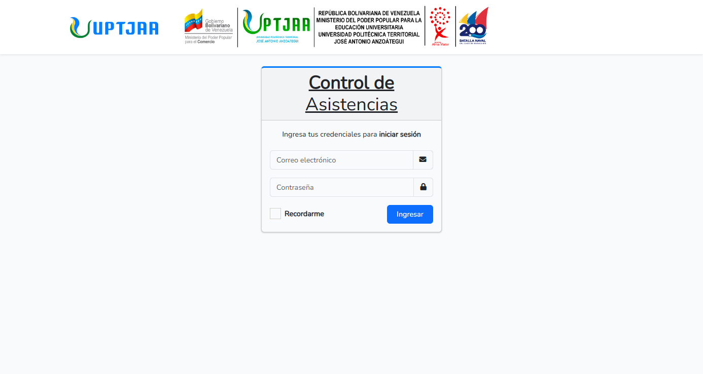
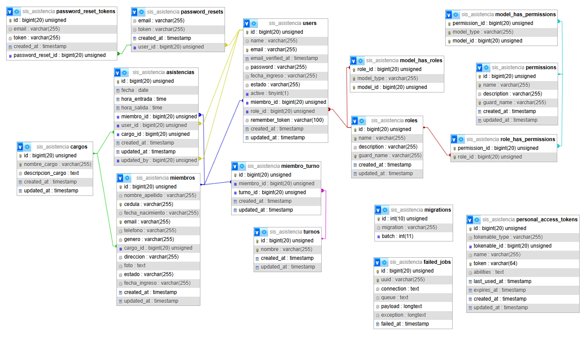

# 📌 Sistema de Registro y Control de Asistencias

  

Este proyecto fue desarrollado en **Laravel** como parte de mi **proyecto de grado universitario**.  
Además, representa un hito personal importante porque fue **el primer sistema que desarrollé por mi cuenta de principio a fin**.  

El **Sistema de Registro y Control de Asistencias** permite gestionar de manera eficiente el control del personal dentro de una institución.  

---

## 🚀 Descripción del Sistema

Entre sus principales características se encuentran:

- 👤 **Gestión de miembros** con información personal y turnos asignados.  
- ⏱️ **Registro de asistencias** con hora de entrada y salida.  
- 🧑‍💻 **Administración de usuarios** con roles y permisos personalizados.  
- 📊 **Generación de reportes en PDF** por rango de fechas o tipo de personal.  
- 💾 **Respaldo de base de datos** con un solo clic.  
- 🔐 **Buenas prácticas de seguridad** para proteger la información.  

---

## ⚙️ Instalación y Uso

1. **Clonar el repositorio:** →
   git clone https://github.com/Zakeyo/sis_asistencia

2. **Instalar dependencias:** →
   composer install &&
   npm install && npm run dev

3. **Configurar el archivo .env con tu base de datos.**

4. **Ejecutar migraciones y seeders:** →
   php artisan migrate --seed

5. **Iniciar el servidor de desarrollo:** →
   php artisan serve

### 🔑 Credenciales de acceso
Al ejecutar `php artisan migrate --seed`, el sistema creará automáticamente un **usuario administrador por defecto** con las siguientes credenciales:

- **Correo:** `manuelc.dev@gmail.com`  
- **Contraseña:** `123456789`  

Estas credenciales se pueden usar para acceder al sistema en el primer inicio de sesión.

---

## 🖼️ Capturas de Pantalla

  
  
  

---

## 📖 Manual de Usuario (Resumen)

- **Acceso y autenticación** → Login con correo y contraseña.  
- **Panel principal** → Accesos rápidos a usuarios, miembros y asistencias.  
- **Asistencias** → Registro y consulta de entradas y salidas.  
- **Usuarios** → Creación, edición y habilitación/deshabilitación de cuentas.  
- **Roles y permisos** → Configuración de accesos personalizados.  
- **Reportes** → Exportación en PDF con filtros avanzados.  
- **Respaldo de datos** → Copia de seguridad de la base de datos.  

> Para más detalle consulta el [Manual completo](./MANUAL%20DEL%20SISTEMA.pdf).

---

✍️ **Nota Personal:**  
Este sistema fue desarrollado como parte de mi **proyecto de grado universitario**, pero también fue el **primer proyecto que realicé totalmente por mi cuenta**.  
Más allá de ser un trabajo académico, fue un reto personal y profesional que me permitió aplicar mis conocimientos en **Laravel**, **MySQL** y **buenas prácticas de desarrollo web**.